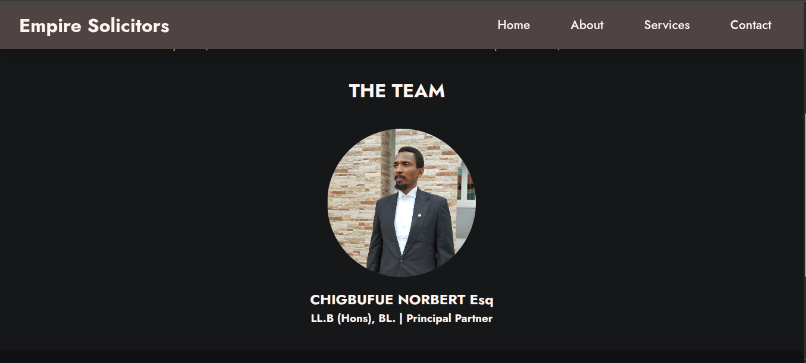

# Empire Solicitors Website

Welcome to the **Empire Solicitors** website repository!  
This project showcases a sophisticated, modern, and fully responsive website for a professional law firm.

---

## 🌟 Features

- **Elegant, Modern Design:**  
  Utilizes a clean layout, custom color palette, and the Jost Google Font for a professional look.

- **Responsive Navigation:**  
  Sticky navbar with a mobile-friendly hamburger menu and active link highlighting for seamless navigation across all devices.

- **Preloader Animation:**  
  A smooth loading animation ensures users experience a polished transition as the site loads.

- **Hero Section:**  
  Eye-catching hero with a prominent welcome message and call-to-action.

- **About Page:**  
  Detailed firm introduction, team member profiles with circular images, and latest news highlights.

- **Services Page:**  
  Service offerings presented in responsive, card-style layouts that adapt beautifully to any screen size.

- **Contact Page:**  
  Easy-to-use contact form and clear contact details for client inquiries.

- **Newsletter Signup:**  
  Footer includes a newsletter subscription form to keep clients updated.

- **Accessibility & Best Practices:**  
  Semantic HTML, alt text for images, and keyboard-friendly navigation.

---

## 🚀 Technologies Used

- **HTML5** & **CSS3** (with CSS variables and media queries)
- **JavaScript** (for interactivity and preloader)
- **Google Fonts** (Jost)
- **Responsive Design** (Mobile-first approach)

---

## 📱 Responsive Design

The website is fully responsive:
- **Desktop:** Multi-column layouts, sticky navigation, and wide hero images.
- **Tablet:** Adaptive card layouts and readable text.
- **Mobile:** Stacked sections, collapsible navigation, and touch-friendly buttons.

---

## 🛠️ How to Use

1. **Clone the repository:**
   ```bash
   git clone https://github.com/PLP-WebTechnologies/feb-2025-final-project-and-deployment-Imisioluwa3.git
   ```
2. **Open the project folder:**
   ```bash
   cd feb-2025-final-project-and-deployment-Imisioluwa3
   ```
3. **Open `index.html` in your browser.**

---

## 📂 Project Structure

```
/
├── index.html
├── about.html
├── services.html
├── contact.html
├── style.css
├── script.js
└── images/
```

---

## ✨ Screenshots




---

## 📄 License

This project is for educational and demonstration purposes and should not be used for without appropiate permision from the author.

---

## 👨‍💻 Author

Developed by Enoch Oluwajoba (https://www.github.com./Imisioluwa3) for the PLP Web Final Project, 2025.

---

**Empire Solicitors — Your Trusted Legal Partner**